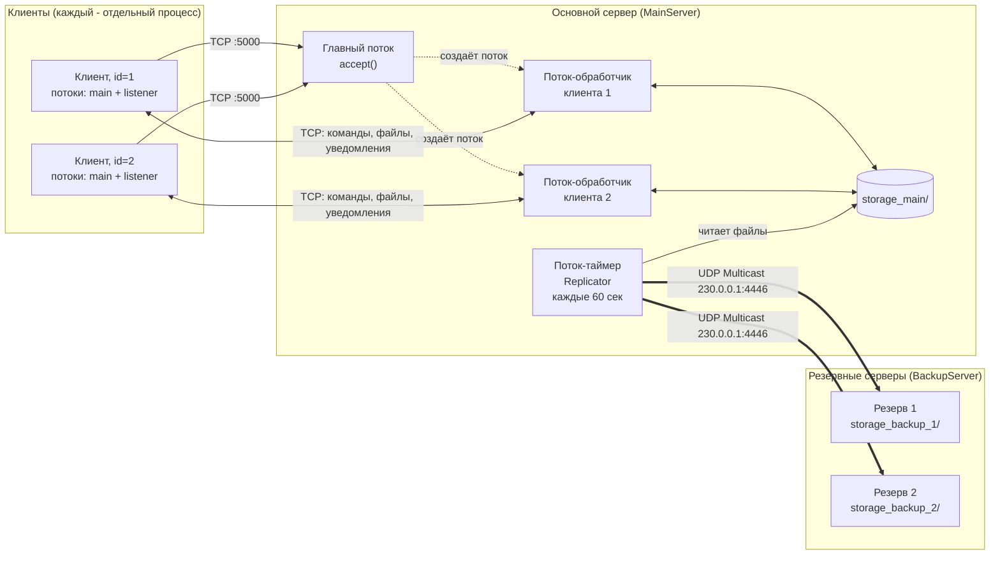

(Mermaid)

---

## Общая архитектура

```mermaid
flowchart LR
    subgraph Clients["Клиенты (каждый - отдельный процесс)"]
        C1["Клиент, id=1<br/>потоки: main + listener"]
        C2["Клиент, id=2<br/>потоки: main + listener"]
    end

    subgraph Main["Основной сервер (MainServer)"]
        ACC["Главный поток<br/>accept()"]
        H1["Поток-обработчик<br/>клиента 1"]
        H2["Поток-обработчик<br/>клиента 2"]
        REP["Поток-таймер<br/>Replicator<br/>каждые 60 сек"]
        ST[("storage_main/")]
    end

    subgraph Backups["Резервные серверы (BackupServer)"]
        B1["Резерв 1<br/>storage_backup_1/"]
        B2["Резерв 2<br/>storage_backup_2/"]
    end

    C1 -- "TCP :5000" --> ACC
    C2 -- "TCP :5000" --> ACC
    ACC -. "создаёт поток" .-> H1
    ACC -. "создаёт поток" .-> H2
    C1 <-- "TCP: команды, файлы, уведомления" --> H1
    C2 <-- "TCP: команды, файлы, уведомления" --> H2
    H1 <--> ST
    H2 <--> ST
    REP -- "читает файлы" --> ST
    REP == "UDP Multicast 230.0.0.1:4446" ==> B1
    REP == "UDP Multicast 230.0.0.1:4446" ==> B2
```
---